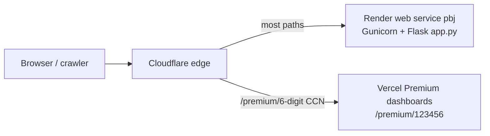
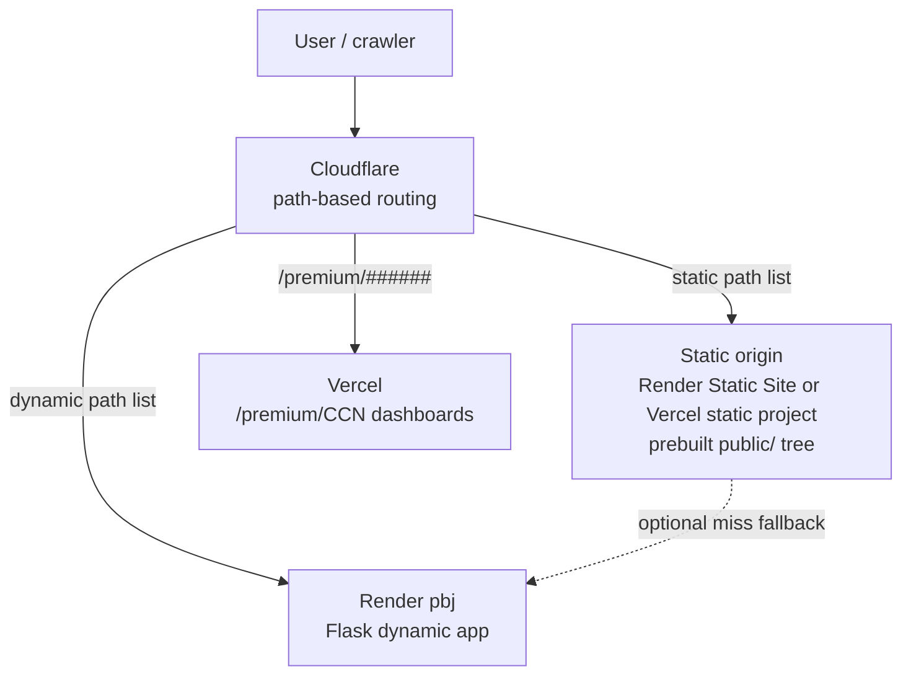

# PBJ320 static front-door migration plan

**Status:** Planning only — no implementation, DNS, routing, or file moves in this pass.  
**Verified from:** `app.py` route table, `premium_redirect_routes.py`, `site_public_config.py`, `render.yaml`, `DEPLOYMENT.md`.

---

## 1. Problem statement

Today `www.pbj320.com` resolves to a **single Render web service** (`pbj`) running Gunicorn + Flask (`app.py`). Public marketing pages, insight reports, CSS, images, and OG assets are served through the same process as provider/state/owner dashboards and APIs.

**Consequence:** Any push to the production-watched branch triggers a **full `buildCommand`** (indexes, ownership DB, sitemap, wrapped build) and **instance replacement**. During the swap, Cloudflare may show **Host Error** (~30–90s observed) while the new container starts and passes `/healthz`.

**Goal:** Separate **static/public** surfaces from **dynamic app** routes so copy and asset edits can ship without recycling the Flask worker.

**Non-goals (this plan):** Implement migration, change DNS, change Cloudflare rules, move files, or edit `app.py`.

---

## 2. Current production architecture



| Layer | Role today |
|-------|------------|
| **Cloudflare** | TLS, caching, bot management; partial path split for Premium CCN dashboards |
| **Render `pbj`** | All primary traffic — static HTML, assets, dashboards, APIs |
| **Vercel** | Facility Premium dashboards at `/premium/<6-digit CCN>` (per `premium_redirect_routes.py`) |
| **`old-pbj320` Render Static Site** | Legacy; **not** production DNS (`DEPLOYMENT.md`) |

Copy-only HTML edits **still** run the full Render build today because there is no separate publish path.

---

## 3. Static / public route inventory (Flask-served today)

Classification: **S** = strong static candidate, **M** = migrate after build-time pre-render, **K** = keep on Flask initially (auth, POST, token, or runtime feed).

### 3.1 Marketing & trust pages

| Path | Handler | Source file / notes | Class |
|------|---------|---------------------|-------|
| `/` | `index()` → `_serve_public_html` | `index.html`; CSRF inject; deep-link redirects | M |
| `/about` | `_serve_public_html` | `about.html` | S |
| `/press` | `_serve_public_html` | `press.html` | S |
| `/data-sources` | `_serve_public_html` | `data-sources.html` | S |
| `/privacy` | `_serve_public_html` | `privacy.html` | S |
| `/terms` | `_serve_public_html` | `terms.html` | S |
| `/phoebe` | `_serve_public_html` | `phoebe.html` | S |
| `/contact` | `_serve_public_html` + POST | `contact.html`; CSRF on GET | K (GET prebuildable; POST stays) |
| `/corrections` | `_serve_public_html` + POST | `corrections.html`; CSRF on GET | K |
| `/attorneys` | 301 → `/contact` | Legacy redirect | S (static redirect rule) |
| `/newsletter` | 301 → `/insights` | Legacy redirect | S |
| `/updates` | 302 → `/?open_subscribe=1` | Anchor redirect | K (or static redirect) |

### 3.2 Premium (partial split already exists)

| Path | Handler | Notes | Class |
|------|---------|-------|-------|
| `/premium` | `premium_redirect_routes` | `premium/index.html`; `Cache-Control: public, max-age=300` | S |
| `/premium/` | 301 → `/premium` | Trailing-slash fix (Vercel 404 risk) | S |
| `/premium-assets/*` | `try_serve_premium_asset` | OG images, CSS, JS for marketing | S |
| `/premium-samples/*` | `try_serve_premium_asset` | Demo HTML samples | S |
| `/premium/<path>` (non-CCN) | catch-all / premium routes | Blocked segments: `tips`, `methods`, `pricing` | S |
| `/premium/<6-digit CCN>` | **Vercel** (Cloudflare rule) | Facility dashboards — **not** Flask in prod | — (already off Render) |
| `/api/premium/dashboard-request` | POST JSON | Email notification | K |
| `/api/premium/routing-check` | GET JSON | Diagnostics | K |

### 3.3 Insights & public reports

| Path | Handler | Notes | Class |
|------|---------|-------|-------|
| `/insights` | `render_template('insights_hub.html')` | Substack RSS + native posts merged server-side; JSON-LD ItemList | M |
| `/insights/trends` | `_serve_public_html` | `insights.html` | S |
| `/insights/ny-minimum-staffing` | `_serve_public_html` | `insights-ny-minimum-staffing.html` (large embedded JSON) | S |
| `/insights/ny-minimum-staffing/press` | `_serve_public_html` | `insights-ny-minimum-staffing-press.html` | S |
| `/insights/ny-minimum-staffing/classic` | 301 → canonical | Deprecated palette | S (redirect) |
| `/insights/ny-minimum-staffing-2025` | 301 → canonical | Legacy slug | S (redirect) |
| `/insights-visualizations` | 301 → `/insights/trends` | Legacy | S (redirect) |
| `/insights/<slug>` | `render_template_string` | Native articles from `insights_posts/*.md` | M |
| `/preview/ny-staffing-compliance-2025/<token>` | `_serve_ny_staffing_report_preview` | Env token (`NY_STAFFING_REPORT_PREVIEW_TOKEN`); `noindex` | K |
| `/preview/ny-staffing-compliance-2025` (no token) | 404 | Gate | K |

### 3.4 SEO explainer pages (inline HTML, no file)

| Path | Handler | Class |
|------|---------|-------|
| `/what-is-hprd` | `_render_explainer_page` | M (prebuild) |
| `/nursing-home-staffing-data` | `_render_explainer_page` | M |
| `/pbj-nursing-home-staffing` | 301 → `/nursing-home-staffing-data` | S |
| `/pbj-job-codes` | 301 → `/phoebe` | S |
| `/cms-payroll-based-journal` | 301 → `/phoebe` | S |

### 3.5 Other public HTML / samples

| Path | Handler | Class |
|------|---------|-------|
| `/pbj-sample` | Feature-flagged HTML; optional AI block strip | M |
| `/pbj-ai-support` | Env-gated; runtime string replacements | M |
| `/ai/prompts` | Template `ai_prompts.html` | M |
| `/chow`, `/chow/` | 404 (not public) | — |
| `/chow.html` | 301 → `/` | S |

### 3.6 Public CSS, JS, images, media

| Path pattern | Handler | Examples | Class |
|--------------|---------|----------|-------|
| Dedicated routes | `send_from_directory` / `send_file` | `insights-theme.css`, `public-trust.css`, `chow.css`, `contact-popup-shared.css`, `pbj-site-universal.js`, `state-page-charts.js`, `pbj-ai-support.css/js`, owner CSS/JS at root | S |
| `/static/img/*` | `send_from_directory` | Shared images | S |
| `/images/*` | `send_file` | Root image tree | S |
| `/favicon.ico`, `/pbj_favicon.png`, `/apple-touch-icon.png` | favicon handlers | | S |
| `/LI-In-Bug.png`, `/substack.png` | dedicated | Social icons | S |
| `/press/wtvr-*.mp4`, `/press/wtvr-thumbnail.jpg` | dedicated | Press media | S |
| `/ai-icons/*` | SVG icons for AI support page | S |
| `/<path:filename>` catch-all | `static_files()` | `.png`, `.webp`, `.css`, `.js`, `.json`, `.mp4` at repo root | S (with exclusions) |
| `/downloads/*` | Dedicated attachment routes | NY verification xlsx/zip | S |
| `/downloads/pbj320-staffing-review.zip` | `send_file` | Skill zip | S |

**Catch-all exclusions (must not move blindly):** `downloads/` handled by Flask routes; `entity/`, `provider/`, `state/` blocked; `data/`, `node_modules/` blocked.

### 3.7 Crawler / discovery files

| Path | Handler | Class |
|------|---------|-------|
| `/robots.txt` | `build_robots_txt()` runtime | M (build-time artifact; short TTL today) |
| `/llms.txt` | `build_llms_txt()` runtime | M |
| `/sitemap.xml` | Deploy file `data/deploy/sitemap.xml` or runtime fallback | K (phase 4+; see §5) |
| `/search_index.json` | `search_index.json` on disk | K (homepage autocomplete; phase 4+ optional) |

---

## 4. Dynamic route inventory (must remain on Render Flask)

### 4.1 Core dashboards

| Path pattern | Purpose |
|--------------|---------|
| `/provider/<ccn>` | Facility dashboard (cold render, SQLite/CSV) |
| `/state/<state_slug>` | State dashboard |
| `/entity/<int:entity_id>` | Entity dashboard |
| `/<state_slug>` | State alias resolver (e.g. `/ny` → `/state/new-york`) — **high collision risk** |
| `/test/provider/*`, `/test/state/*`, `/test/entity/*` | Test redirects |

### 4.2 Ownership

| Path pattern | Purpose |
|--------------|---------|
| `/owners`, `/owners/ny`, `/owners/ct` | Hub pages |
| `/owners/<path>` | CMS PAC profiles, static HTML shells + API hydration |
| `/owners/api/*`, `/owner/api/*`, `/ownership/api/*` | Ownership JSON APIs |
| `/ownership/*` | Legacy ownership UI |
| `/owner/*` | FEC donor blueprint |

### 4.3 Report & rankings

| Path pattern | Purpose |
|--------------|---------|
| `/report`, `/report?p=fp|hrs|hrr|pi` | Report shell + same-origin data |
| `/report/embed/*` | Path-based embeds (query-param fallback) |
| `/rankings` | 301 → `/report` |

### 4.4 PBJpedia, wrapped, SFF

| Path pattern | Purpose |
|--------------|---------|
| `/pbjpedia`, `/pbjpedia/<path>` | Gated encyclopedia (env flag) |
| `/wrapped`, `/wrapped/*`, `/pbj-wrapped`, `/pbj-wrapped/*` | Built SPA (`pbj-wrapped/dist`) |
| `/sff`, `/sff/*`, `/sff/data/*` | SFF tool assets + data |

### 4.5 APIs & forms

| Path pattern | Purpose |
|--------------|---------|
| `/api/*` | Subscribe CSRF, insights feed, entity summary, state chart data, premium request, provider compliance JSON, etc. |
| `/subscribe` POST | Newsletter signup |
| `/contact`, `/corrections` POST | Form handlers |
| `/admin/subscribers` | Admin view (key-gated) |

### 4.6 Ops & data (runtime)

| Path pattern | Purpose |
|--------------|---------|
| `/health`, `/healthz` | Render liveness |
| `/warmup`, `/warmup/facility-indexes` | Readiness / ops |
| `/debug/*` | Mem / provider index debug |
| `/data/*`, `/data` | CSV/JSON data files (guarded paths) |
| `/chow_index.json` | CHOW index (non-public page today) |
| `/top`, `/owners-test` | Internal/test |

### 4.7 Owner-specific static assets (dashboard JS)

These are **static bytes** but **tightly coupled** to `/owners/*` pages; migrate only with owner UI or serve from static CDN with long cache:

- `/owner-profile.css`, `/owner-profile.js`, `/owner-fec-contributions.js`, `/owners-hub.js`

---

## 5. Flask-specific behavior on “static” pages today

Any static host must reproduce or eliminate these at **build time** or **edge**:

| Behavior | Where applied | Static migration implication |
|----------|---------------|------------------------------|
| **`_rewrite_universal_js_version`** | `_serve_public_html`, preview, report shell | Build step must inject `PBJ_SITE_UNIVERSAL_JS_VERSION` into HTML |
| **`inject_public_html_cms_urls`** | Public HTML | Replace `__CMS_*__` placeholders in built HTML (`site_public_config.py`) |
| **`inject_public_site_verification_meta`** | Public HTML, dynamic layouts | Inject Bing verification meta at build |
| **CSRF token injection** | `/`, `/contact`, `/corrections` | Keep POST on Flask; static GET can use `/api/subscribe/csrf` fetch (already exists for modal) |
| **`inject_ny_staffing_report_preview`** | Preview route only | Stays on Flask (token + banner) |
| **Cache-Control** | `_HTML_CACHE_CONTROL = no-cache, must-revalidate` for most HTML; `private, no-store` for CSRF pages; `public, max-age=300` for `/premium` | Static host can use longer cache for fingerprinted assets; HTML `no-cache` or short TTL until confident |
| **Canonical / OG tags** | Inline in HTML files; insights hub/articles computed in Flask | Prebuild must emit correct `https://www.pbj320.com/...` URLs (`PUBLIC_SITE_ORIGIN`) |
| **JSON-LD** | Insights hub ItemList; native article schema | Prebuild for `/insights` and `/insights/<slug>` |
| **Redirects** | Many 301/302 routes (§3) | Implement at Cloudflare/edge **before** catch-all static |
| **Home deep links** | `resolve_home_deep_link` on `/` | Keep `/` on Flask until redirect logic replicated at edge, **or** only static-serve `/` when no query args |
| **Feature flags** | `pbj_ai_page_enabled`, `pbj_ai_sample_enabled`, PBJpedia gate | Build profiles per env, or keep flagged pages on Flask |
| **Gzip** | Flask `after_request` compress | CDN handles compression |
| **`X-Robots-Tag` / noindex middleware** | Premium paths, APIs, tests | Edge headers for paths that stay proxied |
| **Sitemap dependency** | `scripts/build_sitemap_xml.py` at deploy lists public URLs | Rebuild sitemap when static paths move; avoid stale locs |
| **Search autocomplete** | `index.html` fetches `/search_index.json` | JSON can stay on Flask (CORS same-origin) or sync to static on deploy |

---

## 6. Target architecture

### 6.1 Recommended pattern: Cloudflare front door + dual origin



**Principles:**

1. **Default to Flask** during migration; opt paths **into** static explicitly.
2. **More specific rules first** (API, `/provider/`, `/state/`, `/owners/`, `/report`, `/<state_slug>`) — then static assets, then marketing HTML.
3. **Do not** put a static catch-all ahead of `/<state_slug>` — `/ny`, `/tn`, `/ca` would break.
4. **Preserve existing Premium split:** `/premium/<6-digit CCN>` → Vercel; `/premium` marketing → static origin.
5. **HTML injection moves to CI/build** (`scripts/build_static_public_site.py` — name TBD, not implemented).

### 6.2 Static origin options (decision pending)

| Option | Pros | Cons |
|--------|------|------|
| **Render Static Site** (revive/replace `old-pbj320`) | Same vendor; simple publish dir; no Flask recycle for static deploys | Second deploy pipeline; must narrow publish dir + filters |
| **Vercel static project** | Already used for Premium; `vercel.json` redirects; fast global CDN | Another dashboard; coordinate with existing `/premium/*` rules |
| **Cloudflare Pages** | Single control plane with DNS | New pipeline; R2/Pages build setup |

**Recommendation:** Start with **Render Static Site** dedicated to `static-public/` (minimal publish directory, build filters ignore `app.py`/CSVs) **or** **Cloudflare Pages** if Cloudflare rules are the long-term router anyway. Reuse lessons from `old-pbj320` failure mode (do **not** publish repo root `.`).

### 6.3 Example routing table (target state)

| Traffic | Origin |
|---------|--------|
| `/`, `/about`, `/press`, `/insights/ny-minimum-staffing`, … | Static |
| `/pbj-site-universal.js`, `/insights-theme.css`, `/og-image-1200x630.png`, `/downloads/*.xlsx` | Static (immutable cache) |
| `/provider/*`, `/state/*`, `/entity/*`, `/owners/*`, `/report*`, `/api/*` | Render `pbj` |
| `/<two-letter-state-or-name-slug>` | Render `pbj` |
| `/premium` (exact), `/premium-assets/*`, `/premium-samples/*` | Static |
| `/premium/123456` | Vercel (unchanged) |
| `/preview/*/<token>` | Render `pbj` (or 404 on static) |
| `/healthz`, `/warmup` | Render `pbj` only |

---

## 7. Migration risks

| Risk | Severity | Mitigation |
|------|----------|------------|
| **State slug capture** (`/ny`, `/tn`, `/new-york`) | Critical | Never static-host `/<single-segment>` catch-all; explicit allowlist only |
| **Broken canonical URLs** | High | Build with `PUBLIC_SITE_ORIGIN=https://www.pbj320.com`; link checker in CI |
| **Broken OG / social previews** | High | Smoke `og:image` absolute URLs; Facebook/Twitter debugger on cutover paths |
| **Duplicate routes** (Flask + static both 200) | Medium | During transition, route one origin per path; use `X-PBJ-Static-Origin` debug header |
| **Stale sitemap / Search Console** | Medium | Regenerate `data/deploy/sitemap.xml` in static build; verify locs after each phase |
| **Stale `search_index.json`** | Medium | Keep on Flask until static homepage validated; or copy artifact in static build |
| **CSRF / form breakage** | High | Keep POST on Flask; static contact page posts to same `/contact` URL on app origin |
| **Cloudflare cache of HTML** | Medium | `Cache-Control: no-cache` on HTML; purge on deploy; avoid caching error pages |
| **Redirect loops** | High | Test `/premium/` ↔ `/premium`, trailing slashes, legacy insight slugs |
| **Premium path confusion** | High | Document rule order: CCN → Vercel; exact `/premium` → static; other `/premium/*` → static assets only |
| **Preview token leakage** | Medium | Do not prebuild preview HTML to static; keep server-side token check |
| **Embedded report JSON drift** | Medium | NY report HTML is self-contained; treat as atomic static artifact after QA |
| **CORS / cookie scope** | Medium | Forms and subscribe modal need same-site cookies to `www.pbj320.com` |
| **Deploy rollback complexity** | Medium | Roll back Cloudflare rule before Rollback Render; keep Flask handlers until phase 5 |
| **False sense of zero downtime** | Low | Static deploys are cheap, but **first** static cutover still needs validation; Flask deploys still needed for app changes |

---

## 8. Phased migration plan

Each phase ends with a **validation gate** before the next. No DNS changes required until Cloudflare origin rules are updated (same hostname).

### Phase 0 — Inventory & build contract (no traffic change)

**Work:**

- Freeze route inventory (this document).
- Design `static-public/` output layout mirroring URL paths (e.g. `insights/ny-minimum-staffing/index.html` or `insights/ny-minimum-staffing.html` per host convention).
- Specify build script responsibilities: CMS placeholder substitution, JS version bump, verification meta, JSON-LD for pre-rendered pages.
- Add CI check: built HTML must not contain `__CMS_` or `__CSRF_TOKEN_PLACEHOLDER__` literals.

**Gate:**

- [ ] `python scripts/simulate_render_deploy_gates.py` still passes (unaffected).
- [ ] Dry-run build produces byte-identical *logical* output vs Flask for one page (e.g. `/about`).

---

### Phase 1 — Static origin stand-up (unlisted)

**Work:**

- Create static host with **minimal publish directory** (not repo root).
- Deploy built artifacts to `*.onrender.com` or Pages preview URL.
- Do **not** attach production hostname.

**Gate:**

- [ ] Preview URL serves `/about`, `/insights-theme.css`, `/og-image-1200x630.png` with 200.
- [ ] Spot-check cache headers on assets (`immutable` / long `max-age` where safe).
- [ ] No repository CSVs or gitignored secrets in publish bundle.

---

### Phase 2 — Asset-only cutover (lowest risk)

**Work:**

- Cloudflare rule: route **immutable assets** to static origin (`*.css`, `*.js`, `*.webp`, `*.png`, `/downloads/*` binaries, favicons).
- Flask keeps serving same paths as fallback (origin failover) for one release cycle.

**Gate:**

- [ ] `curl -sI https://www.pbj320.com/pbj-site-universal.js` shows static origin header marker.
- [ ] Lighthouse / manual: homepage, NY report, provider page load assets 200.
- [ ] Purge Cloudflare cache; retest cold load.
- [ ] **No** Flask redeploy required for CSS-only edits afterward (confirm with one trivial asset change).

---

### Phase 3 — Marketing HTML (read-only pages)

**Work:**

- Cut over: `/about`, `/press`, `/data-sources`, `/privacy`, `/terms`, `/phoebe`, `/premium` (+ assets), SEO explainer pages, insight **file-backed** reports (`/insights/ny-minimum-staffing`, press variant, `/insights/trends`).
- Keep `/`, `/contact`, `/insights` hub on Flask until Phase 3b.

**Gate:**

- [ ] Link crawl (`scripts/check_site_links.py` or equivalent) exit 0.
- [ ] OG debugger on `/press`, `/insights/ny-minimum-staffing`.
- [ ] Download links on NY report (`/downloads/*.xlsx`) still 200.
- [ ] Edit `about.html` → static deploy only → verify **no** Render `pbj` redeploy triggered (or decouple auto-deploy).

---

### Phase 3b — Semi-dynamic insights (prebuild)

**Work:**

- Build-time: fetch Substack feed + merge `insights_posts/*.md` → static `/insights/index.html` + per-slug HTML.
- Schedule: rebuild on publish (webhook/cron) or nightly.
- `/api/insights` remains on Flask for client refresh if hub JS still calls it.

**Gate:**

- [ ] `/insights` ItemList JSON-LD validates.
- [ ] Native slug URLs match sitemap entries.
- [ ] New markdown post → rebuild → appears without Flask deploy.

---

### Phase 4 — Homepage & forms (split GET/POST)

**Work:**

- Static GET for `/` (no server-side deep-link redirects — replicate critical redirects at edge or accept Flask fallback for `?ccn=` etc.).
- Static GET `/contact`, `/corrections`; POST remains proxied to Flask.
- Decide: `/search_index.json` on Flask vs copied to static (versioned filename).

**Gate:**

- [ ] Subscribe modal CSRF fetch works from static homepage.
- [ ] Contact form POST 302/200 from static page.
- [ ] Deep links `/?ccn=`, state shortcuts tested.

---

### Phase 5 — Decommission duplicate Flask static handlers

**Work:**

- Remove or 301 Flask routes superseded by static (optional cleanup — **separate PR**, post-stability).
- Retire or suspend `old-pbj320` if redundant.
- Update `DEPLOYMENT.md` route ownership.

**Gate:**

- [ ] 30-day window: no 404 spikes in Search Console.
- [ ] Render `pbj` deploy no longer required for insight HTML/CSS copy edits.
- [ ] Flask deploy count drops measurably.

---

### Phase 6 (optional) — Sitemap & discovery on static

**Work:**

- Publish `sitemap.xml`, `robots.txt`, `llms.txt` from static build.
- Keep Flask fallback during transition.

**Gate:**

- [ ] Google Search Console fetches sitemap successfully.
- [ ] `robots.txt` disallows unchanged from production policy.

---

## 9. Validation checklist (run after any cutover)

```powershell
# Liveness — always Render
curl.exe -s -m 10 "https://www.pbj320.com/healthz"

# Static candidates
curl.exe -sI "https://www.pbj320.com/about"
curl.exe -sI "https://www.pbj320.com/insights/ny-minimum-staffing"
curl.exe -sI "https://www.pbj320.com/pbj-site-universal.js"

# Dynamic — must stay on Flask
curl.exe -sI "https://www.pbj320.com/provider/335513"
curl.exe -sI "https://www.pbj320.com/state/new-york"
curl.exe -sI "https://www.pbj320.com/ny"
curl.exe -sI "https://www.pbj320.com/owners/ny"
curl.exe -sI "https://www.pbj320.com/report"
curl.exe -sI "https://www.pbj320.com/api/subscribe/csrf"

# Premium split
curl.exe -sI "https://www.pbj320.com/premium"
curl.exe -sI "https://www.pbj320.com/premium/335513"

# Downloads
curl.exe -sI "https://www.pbj320.com/downloads/PBJ320_NY_2025_daily_staffing_verification_file.xlsx"
```

Record response headers: `Server`, `CF-Cache-Status`, custom debug (`X-PBJ-Static-Origin` TBD).

---

## 10. Relationship to deploy downtime

| Change type | Today | After static front door |
|-------------|-------|-------------------------|
| NY report HTML / footer CSS | Full Render build + instance swap (~30–90s risk) | Static host deploy only; **no** Flask recycle |
| `app.py` / provider logic | Full Render deploy | Same (unchanged) |
| `requirements.txt` / indexes | Full Render build | Same (unchanged) |

Static migration **does not eliminate** Flask deploy blips for app work; it **decouples** marketing/report copy from them.

---

## 11. Open decisions (before implementation)

1. **Static host vendor:** Render Static vs Cloudflare Pages vs Vercel (non-Premium project).
2. **URL file layout:** `cleanUrls` / trailing-slash policy (align with `premium/vercel.json`: no trailing slash).
3. **Insights hub refresh:** fully static nightly vs on-demand webhook vs hybrid API refresh.
4. **Homepage deep links:** edge redirects vs keep `/` on Flask indefinitely.
5. **Preview routes:** permanent Flask-only vs separate preview hostname (`preview.pbj320.com`).
6. **Whether `pbj` auto-deploy stays on every `master` push** for app repo, while static project watches `static-public/` paths only (monorepo path filters).

---

## 12. Out of scope (explicit)

- DNS changes
- Cloudflare rule implementation
- Moving or renaming repo files
- `app.py` refactors
- Conditional `render.yaml` `buildCommand` (complementary optimization; separate effort)
- Retiring Render `pbj` or reducing Gunicorn footprint
- Migrating Premium CCN dashboards (already on Vercel)

---

## 13. Related docs

| Doc | Relevance |
|-----|-----------|
| `DEPLOYMENT.md` | Production runbook; brief target route split (§ deferred) |
| `RENDER_DEPLOY.md` | `old-pbj320` warnings; memory/provider context |
| `docs/LFS_BANDWIDTH.md` | LFS vs static deploy bandwidth |
| `premium_redirect_routes.py` | Premium / Cloudflare / Vercel split |
| `site_public_config.py` | Canonical origin, CMS placeholders, verification meta |

---

*Document version: 2026-06-08 — planning pass only.*
